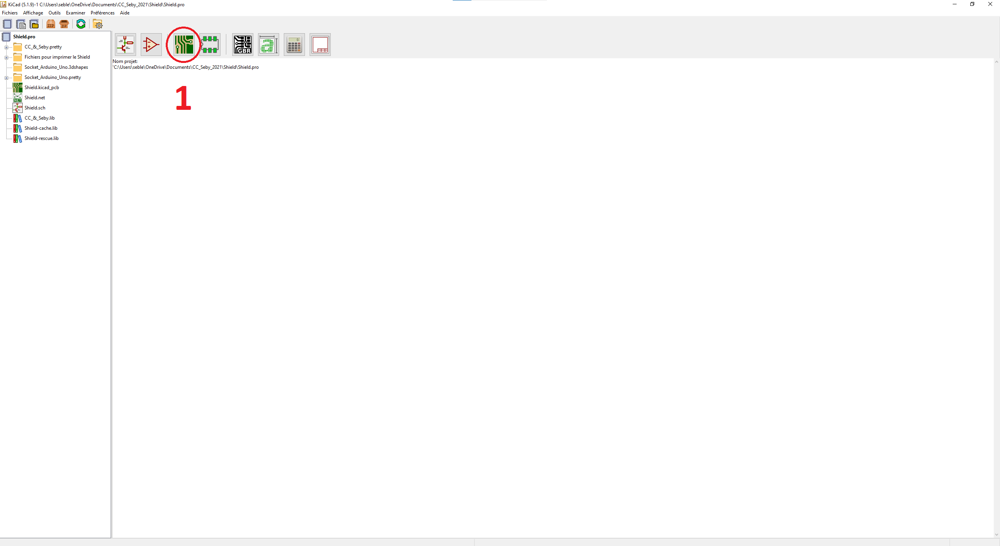
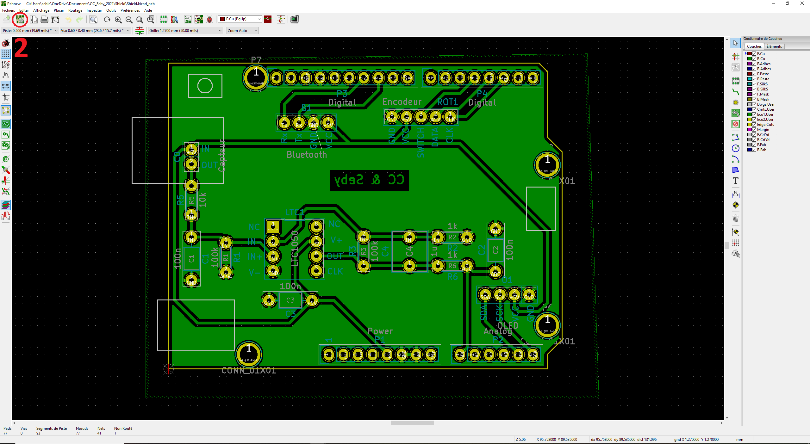
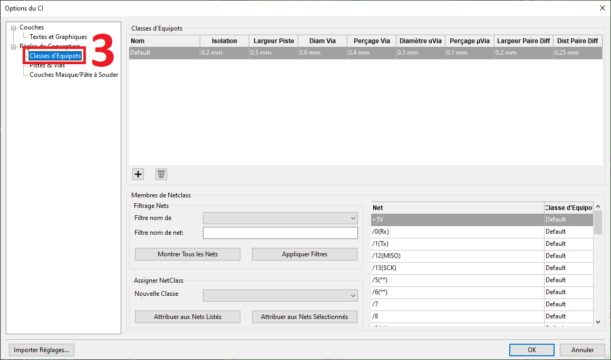
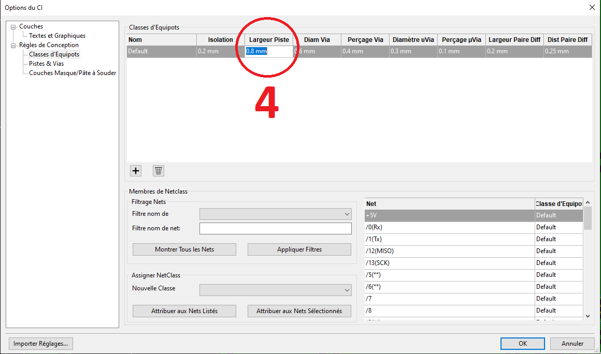

# Projet Capteur Graphite

Nous vous souhaitons bonne navigation dans notre GitHub ! 

# Sommaire
<!-- TOC depthFrom:2 -->
  - [1. Description](#1-description)
  - [2. Configuration de l'environnement logiciel](#2-configuration-de-lenvironnement-logiciel)
    - [2.1. Arduino](#21-arduino)
      - [2.1.1. Bibliothèques](#211-bibliothèques)
    - [2.2. KICAD](#22-kicad)
    - [2.3. Application Android](#23-application-android)
      - [2.3.1. Installer l'application](#231-installer-lapplication)
      - [2.3.2. Modifier l'application](#232-modifier-lapplication)
  - [3. Améliorations Possibles](#3-améliorations-possibles)
    - [3.1. Amélioration 1 : KICAD - Taille des pistes](#31-amélioration-1--kicad---taille-des-pistes)
    - [3.2. Amélioration 2 : KICAD - Taille des pastilles](#32-amélioration-2--kicad---taille-des-pastilles)
    - [3.3. Amélioration 3 : KICAD - Place du capteur](#33-amélioration-3--kicad---place-du-capteur)
    - [3.4. Amélioration 4 : KICAD - Orientation de l'encodeur rotatoire](#34-amélioration-4--kicad---orientation-de-lencodeur-rotatoire)
  - [4. Remerciements](#4-remerciements)
  - [5. Informations sur les auteurs](#5-informations-sur-les-auteurs)
<!-- /TOC -->

## 1. Description 

Ce Git contient tous les fichiers requis pour le projet capteur 2021 du Génie Physique de l'INSA de Toulouse.

**Code Arduino**

- Mesure la tension de sortie du circuit transimpédance
- Envoie la mesure de la tension en Bluetooth sur 1 octet
- Calcule la résistance du capteur grâce à l'équation de transfert du circuit dans la data sheet
- Affiche les mesures sur un écran oled 128x32
- Gère l'encodeur rotatoire pour interagir avec un menu sur l'écran oled

**KICAD**

Projet complet de design de shield pour Arduino Uno :

- Interface un module Bluetooth
- Interface un écran oled
- Interface notre capteur graphite via un circuit transimpédance
- Interface un encodeur rotatoire

**Application Android**

- Récupère la mesure de tension
- Calcule la résistance du capteur grâce à l'équation de transfert du circuit dans la data sheet
- Affiche la valeur de la résistance 
- Trace un graphique déroulant de la résistance du capteur
- Mise à l'échelle du graphique grâce à un slider

**Data Sheet**

## 2. Configuration de l'environnement logiciel

### 2.1. Arduino

Lien pour installer l'IDE Arduino sur sa machine : https://www.arduino.cc/en/software

#### 2.1.1. Bibliothèques

À installer depuis l'IDE ou GitHub : 
- Adafruit GFX Library : https://github.com/adafruit/Adafruit-GFX-Library
- Adafruit SSD1306 : https://github.com/adafruit/Adafruit_SSD1306
- Adafruit BusIO : https://github.com/adafruit/Adafruit_BusIO

Comment installer une bibliothèque Arduino ? : https://www.arduino.cc/en/Guide/Libraries#how-to-install-a-library

### 2.2. KICAD

Lien pour installer KICAD sur sa machine : https://www.kicad.org/

### 2.3. Application Android

#### 2.3.1. Installer l'application

Lien pour installer un fichier .apk à partir d'un PC : https://fr.wikihow.com/installer-sur-un-Android-des-fichiers-APK-%C3%A0-partir-d%E2%80%99un-PC

#### 2.3.2. Modifier l'application

Pour modifier le code de l'application Android, vous pouvez utiliser le fichier en .aia dans MIT Inventor : https://appinventor.mit.edu/

## 3. Améliorations Possibles

### 3.1. Amélioration 1 : KICAD - Taille des pistes

À l'INSA Toulouse, la méthode d'impression du Shield par photolithographie avec du matériel rudimentaire a engendré de nombreux court-circuits entre les pistes de la plaque. Il peut-être judicieux d'augmenter la taille des pistes du PCB dans KICAD selon le matériel. **À l'INSA 0.8mm sont recommandés**

**Comment modifier la taille des pistes ?**

Il faut ensuite supprimer les pistes et refaire le routage de la carte.

### 3.2. Amélioration 2 : KICAD - Taille des pastilles

À l'INSA Toulouse, le foret de la perceuse a un diamètre de 0.8mm, il faut donc prévoir un **perçage supérieur ou égal à 0.8mm**.

### 3.3. Amélioration 3 : KICAD - Place du capteur

**Description du problème**

Les pins de connexion fournis du shield à l'Arduino étant un peu courts. Les soudures des connexions du capteur sont en contact avec le boitier de blindage de l'USB qui est à la masse. Nous avons rajouté une feuille de papier entre le Shield et l'Arduino afin d'assurer l'isolation. Un changement de design du Shield serait donc judicieux avant toute nouvelle impression.

**Solution Proposée**

### 3.4. Amélioration 4 : KICAD - Orientation de l'encodeur rotatoire

**Description du problème**

Le bouton poussoir de l'encodeur rotatoire est actuellement orienté vers l'intérieur du shield. La manipulation pourrait être améliorée en orientant l'encodeur vers l'extérieur du shield.

**Solution proposée**

## 4. Remerciements

Nous tenons à remercier toutes les personnes qui nous ont aidé tout au long de ce projet !

## 5. Informations sur les auteurs

**Séléna PONDARD**

Étudiante en 4ème année du Génie Physique de l'INSA de Toulouse

Mail : pondard@etud.insa-toulouse.fr

**Sébastien LENI**

Étudiant en 4ème année du Génie Physique de l'INSA de Toulouse

Mail : leni@etud.insa-toulouse.fr
